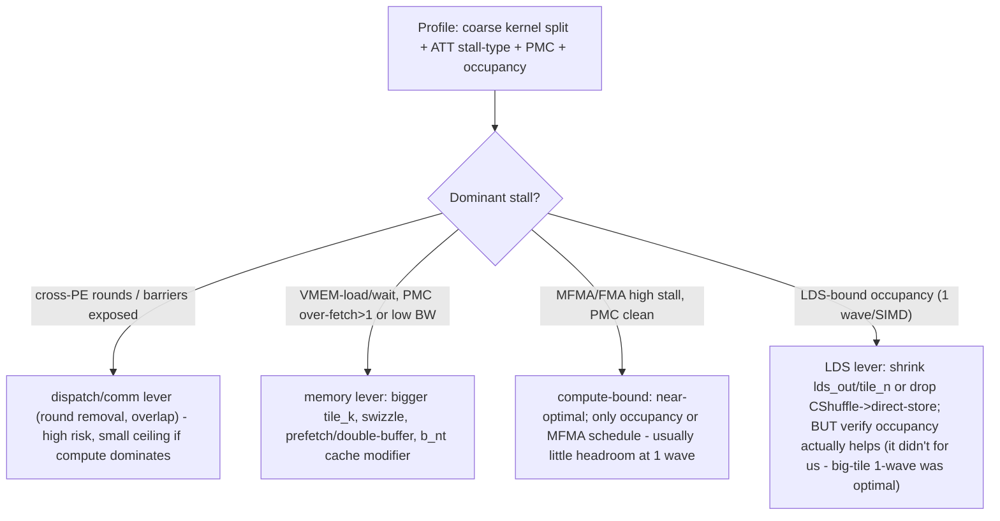

# FlyDSL kernel optimization playbook (gfx950 / MI355X)

Reusable, transferable playbook distilled from the MegaMoE stage-1 optimization work (dispatch redesigns +
GEMM tuning, 2026-07). Use this when optimizing ANY FlyDSL kernel: it captures the profiling capability we
built, the gotchas that cost us time, the tuning knobs/edit patterns, and the profile-first decision method.

Pairs with (read these for depth):
- `megamoe/FLYDSL_KERNEL_DEBUG_TOOLKIT.md` - device-side `fx.printf` deadlock debugging + the symptom->tool map.
- `FLYDSL_KERNEL_AUTHORING.md` - safe-editing / escalation playbook.
- `TRACE_PROFILING.md` - server-level torch/kineto trace how-to (+ the cuda-graph timing caveat).
- `megamoe/KERNEL_OWNER_DECODE_PLAN.md` - the worked case study (measured budgets + every lever tried/pruned).
- Official FlyDSL skills (local, branch `mega_moe_v1`): `/sgl-workspace/FlyDSL/.claude/skills/{gemm-optimization,
  lds-optimization,prefetch-data-load,kernel-trace-analysis,capture-kernel-trace,debug-flydsl-kernel,oob-detection,
  flydsl-kernel-authoring,flydsl-tile-programming}/SKILL.md` + `/sgl-workspace/FlyDSL/docs/kernel_tuning_guide.md`.

---

## 0. The golden rules (learned the hard way)

1. **Profile FIRST, then tune.** We twice invested in dispatch redesigns (recv 2B-i/2B-ii) and an occupancy
   lever (tile_n) that measurement later killed. `kernel_tuning_guide`: "guessing without a trace just moves the
   bottleneck." Measure the budget -> pick the dominant cost -> only then edit.
2. **Oracle-gate every kernel edit** (relL2 vs a torch/atom reference), NEVER self-consistency. A self-consistent
   change once passed micro-checks but was corrupt on the server. `tests/kernels/test_mega_moe.py` bs {1,8,64,512,2048},
   all-8-rank PASS.
3. **Measurement noise is real.** gfx950 is ~+-14% cold; even warm, at ~1.7 ms (prefill bs2048) the run-to-run
   floor is ~+-1.2%. Effects <~1.5% there are NOISE unless confirmed by median-of-many. Small-time points (bs64,
   ~0.4 ms) are tight (~+-0.05%). Use tight repeats and non-overlapping clusters before claiming a % win.
4. **Additive / default-off.** Land experiments as env-gated hooks or new compile flags; keep the shipping path
   untouched; a known-good fallback always stays.
5. **Graph-safety.** Keep monotonic-epoch / no-reset discipline for any cross-PE flag (a reset-based path was
   corrupt under cuda-graph). Epilogue/GEMM-only edits are graph-safe; cross-PE surgery is not, by default.
6. **Cache-clear before every rebuild:** `rm -rf ~/.flydsl /tmp/flydsl*` (FlyDSL caches HSACO aggressively).

---

## 1. Profiling capability (the commands)

Run in the eager micro-harness (`tests/kernels/test_mega_moe.py`, 8-rank torchrun) so cuda-event + ATT timings
are real. (Decode under cuda-graph has garbage per-kernel timings - see `TRACE_PROFILING.md` §2.)

### 1a. Kernel discovery + coarse per-kernel time (eager = valid)
```bash
PYTHONPATH=/sgl-workspace/FlyDSL MORI_SHMEM_HEAP_SIZE=40G rocprofv3 --stats --kernel-trace -f csv -o /tmp/discover -- \
  torchrun --standalone --nproc_per_node=8 tests/kernels/test_mega_moe.py --network v4_pro --quant a8w4 --tokens 64 --mtpr 8192 --iters 5
# parse /tmp/discover_kernel_stats.csv (Name,Calls,TotalDurationNs,AverageNs). rocprof absolute us are inflated;
# RATIOS between kernels are valid. Our kernels: moe_gemm1_0 (fused dispatch+gemm1), mfma_moe2_...fusedP2P_pe8
# (fused stage2). The mfma_moe1_silu / ep_dispatch/combine_intranode entries are the atom/mori BASELINES the test
# also runs - don't confuse them for ours.
```

### 1b. Source-mapped ATT (per-instruction stall, mapped to .py lines)
Decoder install (one-time; rocprofv3 needs `librocprof-trace-decoder.so` in /opt/rocm/lib):
```bash
cp -a <found>/librocprof-trace-decoder.so.* /opt/rocm/lib/ && ln -sf /opt/rocm/lib/librocprof-trace-decoder.so.* /opt/rocm/lib/librocprof-trace-decoder.so && ldconfig
# (a copy exists under _rocm_sdk_core/lib in pip rocm-sdk layers; the skill also has a wget install)
```
input.yaml + run (needs debug info for source mapping):
```yaml
jobs:
  - kernel_include_regex: "moe_gemm1_0"   # exact/regex from 1a
    kernel_iteration_range: "[1, [2-4]]"  # skip warmup
    advanced_thread_trace: true
    att_target_cu: 1
    att_shader_engine_mask: "0xf"
    att_buffer_size: "0x6000000"
    output_format: [csv]
    output_directory: /tmp/kernel_trace_output
    output_file: out
```
```bash
FLYDSL_DEBUG_ENABLE_DEBUG_INFO=1 rocprofv3 -i /tmp/input_trace.yaml -- torchrun ... test_mega_moe.py ...
python /sgl-workspace/FlyDSL/.claude/skills/kernel-trace-analysis/scripts/hotspot_analyzer.py <ui_output_agent_*_dispatch_*> --topk 20 --mode src
```

### 1c. PMC (cache/HBM counters; SEPARATE pass, <=4 TCC counters, no decoder needed)
```yaml
# job A: pmc: [TCC_HIT_sum, TCC_MISS_sum, TCC_REQ_sum]   ; job B: pmc: [TCC_EA0_RDREQ_sum, TCC_EA0_RDREQ_32B_sum]
# kernel_include_regex: "moe_gemm1_0"  ; run each with FLYDSL_RUNTIME_ENABLE_CACHE=1
```
- L2 hit = HIT/(HIT+MISS); 32B fraction = RDREQ_32B/RDREQ (0% = clean full 64B lines); HBM bytes = (RDREQ-RDREQ_32B)*64+RDREQ_32B*32.
- Output: `<dir>/pass_1/<file>_counter_collection.csv`. The CSV also carries **authoritative** `VGPR_Count`,
  `Accum_VGPR_Count`, `SGPR_Count`, `LDS_Block_Size`, `Workgroup_Size` (better than hotspot_analyzer's ISA estimate).

### 1d. Occupancy math (gfx950 / CDNA4)
waves/SIMD = `min(VGPR_limit, LDS_limit, SGPR_limit)`:
- VGPR: `512 // (arch_vgpr + accum_vgpr)` (combined 512-entry pool; alloc gran 8).
- LDS: `(160 KB // LDS_per_WG)` WGs/CU -> `* waves_per_WG / 4 SIMDs`. **160 KB/CU, 1280 B alloc granularity.**
- SGPR: usually ample. Whichever is smallest binds. Example: LDS 98 KB/WG -> 1 WG/CU -> 1 wave/SIMD (LDS-bound),
  even though VGPR=228 alone allows 2.

---

## 2. Isolating an inner phase of a FUSED / cross-PE kernel (novel, high-value)

Problem: our GEMM is fused with a cross-PE dispatch prologue. Single-CU ATT gets **swamped by block0's spin-wait
busy-loop** (`int32_wait_until...`): a spin loop accumulates stall cycles across all waves and dwarfs everything,
so the GEMM K-loop shows ~0% even though it's the real work. Two fixes:

1. **Post-filter `code.json`** to keep only the source files you care about, then re-run `hotspot_analyzer.py`:
```python
import json,os,shutil
d=<dispatch_dir>; out=d+"_filt"
data=json.load(open(os.path.join(d,"code.json")))
keep=("kloop.py","gemm1.py","utils.py","epilogue.py")   # drop dispatch.py spin
data["code"]=[r for r in data["code"] if any(k in (r[3] or "") for k in keep)]
shutil.copytree(d,out,dirs_exist_ok=True); json.dump(data,open(os.path.join(out,"code.json"),"w"))
```
2. **Scan all per-rank agent dirs.** An 8-rank run yields 8 `ui_output_agent_<pid>_dispatch_*` dirs; on some
   ranks `att_target_cu=1` lands on a pure-GEMM CU (not block0). Sum stall-by-file per dir and pick the one with
   high `kloop.py`/`gemm1.py` share. (Combine with the post-filter for a clean per-line profile.)
- Reliable output = the **"Stall Breakdown by Type"** (MFMA vs VMEM-wait vs LDS-wait vs barrier). Beware the
  `kloop.run()` **call-site line** showing huge % = debug-info aggregation artifact (Pattern 5), not a real hotspot.
- There is NO GEMM-only compile path (dispatch prologue is unconditional) - so the above is how you profile the
  GEMM in a fused kernel without a code change.

---

## 3. Environment / process gotchas checklist (each cost us a run)

- **ATT finalize crashes** under multi-rank torch teardown (GIL race, SIGABRT) AFTER writing the trace -> data is
  VALID; just kill stragglers. Never trust exit code alone; check for `ui_output_agent_*` dirs.
- **Kill by numeric PID**, never `pkill -f <pattern>` where the pattern matches your own command line (self-match
  kills the wrapper -> "0 ms empty" exit). Recipe: `for pid in $(rocm-smi --showpids | awk '/^[0-9]/{print $1}'); do kill -9 $pid; done`.
- **VRAM stragglers** from killed processes cause the NEXT run to OOM ("tried to allocate 63 GiB"). Always clean +
  confirm `rocm-smi --showmeminfo vram` back to ~0.3 GB/GPU before the next run.
- **Cache-clear** (`rm -rf ~/.flydsl /tmp/flydsl*`) before every rebuild after editing a kernel, else your change
  (or `fx.printf`) may not be in the binary that runs.
- **Debug info** (`FLYDSL_DEBUG_ENABLE_DEBUG_INFO=1`) is required for ATT source mapping - and it recompiles, so
  cache-clear too.

---

## 4. FlyDSL tuning knobs + edit patterns (what's safe, what's fragile)

### Config knobs (safe-ish, oracle-gated) - `resolve_stage1_config` / the MegaStage1 tune JSON
`tile_m, tile_n, tile_k, b_nt, waves_per_eu, slice_k, use_async_copy, xcd_swizzle, gate_mode`. Bucketed per
`(network, quant, bs)`. **`b_nt` (B-load cache modifier) was our one robust win**: non-temporal fp4 weight loads
help decode (bs8-64 ~ -3..-5%, avoids L2 pollution when weights stream once for few tokens) but hurt prefill
(reuse) -> set per bucket. Pure cache hint: no layout/LDS/grid/correctness change.

### Env-gated default-off hooks (the safe A/B mechanism)
Add `os.environ.get("MEGA_S1_<KNOB>")` overrides in `resolve_stage1_config` (or a compile const) so you can sweep
without touching the tuned table or shipping default. Remove or fold the winners into the tune JSON after
cross-network validation.

### Correctness-preserving edit patterns we used
- **Ceiling division** for tile-schedule counts so smaller tiles don't underflow to 0 (`(x + pack - 1)//pack`,
  and `max(1, n_phases)`). A floor `//` gave `pipe_n_phases=0 -> //0` at tile_k<256.
- **Buffer resource sizing:** a tensor kernel-arg packs its element count as **i32** -> a >2 GB buffer overflows
  the C-ABI. Pass the base pointer via a disp-table slot and build the resource in-kernel with
  `create_buffer_resource_from_addr(addr_i64)` (defaults num_records to 0xFFFFFFFF = 4 GB).
- **LDS budget analysis:** `build_lds_views`/`plan_lds`; pong head = `max(x_pong, lds_out)`; the **CShuffle
  epilogue scratch `lds_out = 4*tile_m*tile_n`** often dominates (was 66% of our 98 KB), not the X tile or tile_k.
- **K-loop scheduling:** phase-table pipeline in `build_pipe_schedule` (utils.py) -> `KLoop._interleaved_half`;
  MFMA<->load interleave via hardcoded `isched`/`ck_rate` (`gemm1.py`) + `rocdl.sched_mfma/vmem/dsrd` hints.
  These are correctness-neutral (scheduling only) but gave no robust win on our MFMA-bound loop.

### Fragile - avoid unless you must (and expect cross-PE deadlocks)
Cross-PE dispatch surgery (rendezvous / co-residency): small perturbations deadlock (7 GPUs spin, 1 idle) or
corrupt under graph. `tile_k` changes hit both a layout divzero AND the co-residency invariant. Keep changes to
the GEMM/epilogue (pure-compute) unless doing kernel-owner co-design.

---

## 5. Profile-first decision tree (which lever for which bottleneck)


Regime matters: **decode** (small M) is latency / weight-BW bound; **prefill** (large M) is compute/MFMA bound.
The same knob can help one and hurt the other (b_nt, tile_n) -> tune per bucket. gfx950 rule of thumb: M<=512 is
memory/latency-bound.

---

## 6. Case-study index (what we tried on MegaMoE, and the answer)
All detail in `megamoe/KERNEL_OWNER_DECODE_PLAN.md` + `megamoe/COMPACT_SINGLE_ROUND_DESIGN.md`:
- Dispatch cross-PE round ~= 11.6% of decode (bounded); recv 1-round scheme is bit-correct but +5% (scatter+barrier
  cost > round saved); 2B-ii gather starves the GEMM (worse). => ship compact-only.
- GEMM decode+prefill is the majority; occupancy is NOT the lever (tile_n=128 -> 2 waves REGRESSED all bs; the
  big-tile/1-wave trade is correct). K-loop is MFMA-pipeline-bound (48.5% MFMA stall), so scheduling/prefetch
  give no robust win; ~13% vs dp-opus (hand-tuned asm) is not reachable via FlyDSL-level tweaks.
- The one robust, shippable GEMM win: **`b_nt` per bucket** (decode non-temporal weights, ~ -5% at bs64).
- Comm/compute overlap: deprioritized (dispatch ~1-2% at prefill, unhideable at decode).
